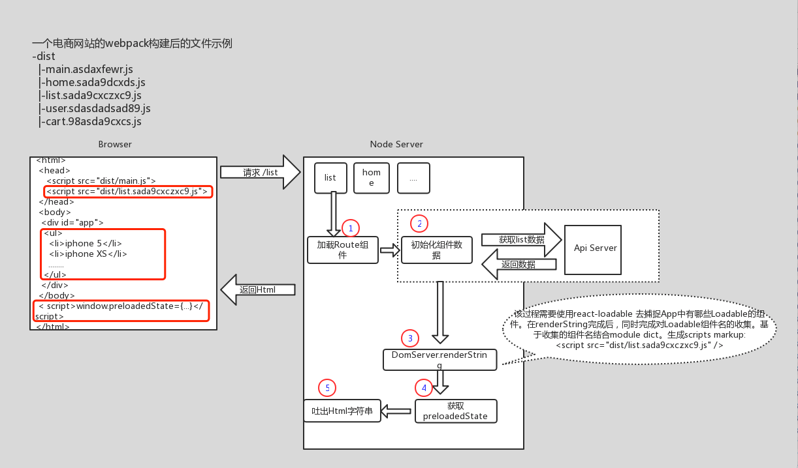

# dva-ssr

## react服务端渲染demo (基于Dva)

### 使用

- npm install
- npm run buildClient
- npm run buildServer
- npm run ssr
- view localhost:3000

### 功能

- 基于 Dva 的 SSR 解决方案
- 支持 Code Splitting （不再使用Dva自带的 dva/dynamic加载组件）
- 支持 CSS Modules

### SSR实现逻辑

#### 概览



上图是SSR的运行时流程图（暂时不考虑构建的问题）

图中左侧是浏览器端看到的页面源码。其中红色框标识的3个部分，是SSR需要关注的重点内容。

- 最简单的是中间一个框，它是服务端渲染的App的内容部分。

- 第一个是分片（splitting）代码文件。即SSR Server必须要知道，浏览器要正确展示这个页面，需要包含哪些分片的js代码。
如果不计算并返回这个script标签，那么浏览器render这个list 组建时，会发现这个组件不存在，还需要异步加载并re-render 页面。

- 最后一个框，是服务端返回的 window._preloadedState 即 全局状态对象。浏览器端要使用这个对象对redux的store进行初始化。


收到客户端的SSR请求后，SSR Server将依次执行如下五部操作：

1. 对请求的路径，进行路由匹配；并 "获取/加载"(获取对应同步组件，加载对应异步组件) 所涉及的组件

```javascript
  
  // 初始化
  const history = createMemoryHistory();
  history.push(req.path);
  const initialState = {};

  const app = dva({history, initialState});
  app.router(router);
  const App = app.start();
  let routes = getRoutes(app);

  // 匹配路由，获取需要加载的Route组件（包含Loadable组件）
  const matchedComponents = matchRoutes(routes, req.path).map(({route}) => {
    if (!route.component.preload) {
      // 同步组件
      return route.component;
    } else {
      // 异步组件
      return route.component.preload().then(res => res.default)
    }
  });
  const loadedComponents = await Promise.all(matchedComponents);
```

2. 对1中组件进行初始化（如需），进行接口请求，并等待请求返回。

> 注： 需要进行数据初始化的组件，需要定义 static fetching 方法

```javascript
const actionList = loadedComponents.map(component => {
    if (component.fetching) {
      return component.fetching({
        ...app._store,
        ...component.props,
        path: req.path
      });
    } else {
      return null;
    }
  });
await Promise.all(actionList);
```

3. 调用 ReactDOMServer.renderString 渲染数据

```javascript

//  Render Dva App。同时使用Loadable.Capture 捕捉本次渲染包含的Loadable组件集合Array<String>。
const modules = [];
const markup = renderToString(
    <Loadable.Capture report={module => modules.push(module)}>
      <App location={req.path} context={{}}/>
    </Loadable.Capture>
);

//  构造需要render的 script标签。其中利用了react-loadable的webpack插件在构建过程中生成的module字典
let bundles = getBundles(moduleDict, modules);
let scripts = bundles.filter(bundle => bundle.file.endsWith('.js'));
let scriptMarkups = scripts.map(bundle => {
  return `<script src="/public/${bundle.file}"></script>`
}).join('\n');
```

> Loadable 的相关概念和用法，请参考 github: [react-loadable](https://github.com/jamiebuilds/react-loadable)

#### Code Splitting


4. 获取preloadedState

```javascript
const preloadedState = app._store.getState();
```

5. 拼装Html，并返回
```javascript
res.send(`
<!DOCTYPE html>
<html>
  <head>
    <title>React Server Side Demo With Dva</title>
      <link href="/public/style.css" rel="stylesheet">
  </head>
  <body>
    <div id="app">${markup}</div>
    <script>window.__PRELOADED_STATE__ = ${JSON.stringify(preloadedState).replace(/</g, '\\\u003c')}</script>
    <script src="/public/main.js"></script>
    ${scriptMarkups}
  </body>
</html>
`);
```

#### 如何支持Dva

本节分几个部分：

1. 如何既支持 dva/dynamic 又支持 SSR
2. SSR Server 端如何支持 Dva
3. SSR Client 端如何支持 Dva


##### 如何既支持 dva/dynamic 又支持 SSR

之前使用dva的Code Splitting功能时，用的是 dva/dynamic。示例代码如下：

```javascript
import dynamic from 'dva/dynamic';

const UserPageComponent = dynamic({
  app,
  models: () => [
    import('./models/users'),
  ],
  component: () => import('./routes/UserPage'),
});

```

它的问题是不支持SSR。解决方法是使用 react-loadable 代替 dva/dynamic。为了不影响dva的功能，
我们需要了解 dva/dynamic 除了实现了加载组件之外还实现了哪些功能。

通过查阅dva源码，发现 dva/dynamic 额外实现的功能比较纯粹，就是 register model

```javascript
// packages/dva/src/dynamic.js

const cached = {};

function registerModel(app, model) {
  model = model.default || model;
  if (!cached[model.namespace]) {
    app.model(model);
    cached[model.namespace] = 1;
  }
}

// ..... 省略部分代码

export default function dynamic(config) {
  const { app, models: resolveModels, component: resolveComponent } = config;
  return asyncComponent({
    resolve: config.resolve || function () {
      const models = typeof resolveModels === 'function' ? resolveModels() : [];
      const component = resolveComponent();
      return new Promise((resolve) => {
        Promise.all([...models, component]).then((ret) => {
          if (!models || !models.length) {
            return resolve(ret[0]);
          } else {
            const len = models.length;
            ret.slice(0, len).forEach((m) => {
              m = m.default || m;
              if (!Array.isArray(m)) {
                m = [m];
              }
              
              // 注册 model
              m.map(_ => registerModel(app, _));
            });
            resolve(ret[len]);
          }
        });
      });
    },
    ...config,
  });
}

```

因此，我们需要在 react-loadable 的基础上，增加 registerModel 功能，且需要自己维护 cached model 这个对象。

为什么选择 react-loadable ?

通过翻阅若干个支持SSR Code Splitting的Repo，只有 react-loadable 比较好的支持 "多个文件加载"。

下面是react-loadable 的基本用法：
```javascript

Loadable({
  loader: () => import('./components/Bar'),
  loading: Loading,
  timeout: 10000, // 10 seconds
});

```

不难发现， 这是不能够完全匹配 dva/dynamic 的能力的。因为在Dva里，有model这个概念。
我们不仅需要加载UI组件本身，还需要加载它所依赖的model文件。而react-loadable 可以很好的支持这个特性。

下面是 react-loadable 的 Loadable.Map 用法

```javascript
Loadable.Map({
  loader: {
    Bar: () => import('./Bar'),
    i18n: () => fetch('./i18n/bar.json').then(res => res.json()),
  },
  render(loaded, props) {
    let Bar = loaded.Bar.default;
    let i18n = loaded.i18n;
    return <Bar {...props} i18n={i18n}/>;
  },
});
```

经过修改，我们可以得到兼容dva的dynamic方案。
例如，有一个页面叫做 Grid。它依赖2个model，分别是 grid 和 user。

```javascript

 Loadable.Map({
    loader: {
      Grid: () => import('./routes/Grid.js'),
      grid: () => import('./models/grid.js'),
      user: () => import('./models/user.js'),
    },
    delay: 200,
    timeout: 1000,
    loading: Loading,
    render(loaded, props) {
      let Grid = loaded["Grid"].default;
      let grid = loaded["grid"].default;
      let user = loaded["grid"].default;
      registerModel(app, grid);
      registerModel(app, user);
      return <Grid {...props} />;
    },
 });

```

对于复杂的项目，可能有很多route配置，写上面这个配置项代码较多。我们可以考虑对其进行封装。
基于此，我们可以考虑实现 dynamicLoader 方法。

```javascript

const dynamicLoader = (app, modelNameList, componentName) => {
  
  let loader = {};
  let models = [];
  let fn = (path, prefix) => {
    return () => import(`./${prefix}/${path}`);
  };

  if (modelNameList && modelNameList.length > 0) {
    for (let i in modelNameList) {
      if (modelNameList.hasOwnProperty(i)) {
        let model = modelNameList[i];
        if (loader[model] === undefined) {
          loader[model] = fn(model, 'models');
          models.push(model);
        }
      }
    }
  }

  loader[componentName] = fn(componentName, 'routes');

  return Loadable.Map({
    loader: loader,
    loading: Loading,
    render(loaded, props) {
      let C = loaded[componentName].default;

      for (let i in models) {
        if (models.hasOwnProperty(i)) {
          let model = models[i];
          if (loaded[model] && getApp()) {
            registerModel(app, loaded[model]);
          }
        }
      }
      return <C {...props}/>;
    },
  });
};


// 使用

const routes = [{
      path: '/popular/:id',
      component: dynamicLoader(app, ['grid'], 'Grid')
}];

```

但是，上述代码在 SSR Server端是无法工作的。

首先，react-loadable 需要在webpack打包过程中生成Loadable组件的数据字典。
SSR Server 需要利用这个字典的信息生成 分片js代码的 script 标签。

字典文件示例：

```javascript
// react-loadable.json

{
  "./routes/Grid.js": [
    {
      "id": 141,
      "name": "./src/routes/Grid.js",
      "file": "0.js",
      "publicPath": "/public/0.js"
    }
  ],
  "lodash/isArray": [
    {
      "id": 296,
      "name": "./node_modules/lodash/isArray.js",
      "file": "0.js",
      "publicPath": "/public/0.js"
    },
    {
      "id": 296,
      "name": "./node_modules/lodash/isArray.js",
      "file": "1.js",
      "publicPath": "/public/1.js"
    }
  ]
  //... 以下省略
}

```

实际使用发现，上述代码 dynamicLoader 无法生成正确的字典。

后经过Debug发现，问题根源是代码中使用了带参数的 import。即 <b>import(`./${prefix}/${path}`)</b>，
而webpack 在构建过程中无法静态获取Loadable组件的路径。因此，不能使用带参数的 import。

最终的方案是，定义路由配置文件 routes.json。然后编写一个路由生成器，生成需要的路由文件。

示例的routes.json 文件如下：

```javascript

[
  {
    "path": "/",
    "exact": true,
    "dva_route": "./routes/Home.js",
    "dva_models": []
  },
  {
    "path": "/popular/:id",
    "dva_route": "./routes/Grid.js",
    "dva_models": [
      "./models/grid.js"
    ]
  },
  {
    "path": "/topic",
    "dva_route": "./routes/Topic.js",
    "dva_models": []
  }
]

```

到此，我们就完成了对于dva/dynamic 和 SSR 的支持。

##### SSR Server 端如何支持 Dva

1. app.start 

默认情况下：
```javascript
app.start('#root');
```

server 端应该不加参数

```javascript
// 官方示例
import { IntlProvider } from 'react-intl';
...
const App = app.start();
ReactDOM.render(<IntlProvider><App /></IntlProvider>, htmlElement);

// 本实现的示例

const App = app.start();
const markup = renderToString(
    <Loadable.Capture report={module => modules.push(module)}>
      <App location={req.path} context={{}}/>
    </Loadable.Capture>
  );
```

2. model register

```javascript

const matchedComponents = matchRoutes(routes, req.path).map(({route}) => {
    if (!route.component.preload) {
      return route.component;
    } else {
      
      // 加载Loadable组件
      return route.component.preload().then(res => {
        if (res.default) {
          // Loadable 组件
          return res.default;
        } else {
          // Loadable.Map 组件
          let result;
          for (let i in res) {
            if (res.hasOwnProperty(i)) {
              if (res[i].default.hasOwnProperty('namespace')) {
                // model 组件
                registerModel(app, res[i]);
              } else {
                // route 组件
                result = res[i].default;
              }
            }
          }
          return result;
        }
      })
    }
  });


```

3. 调用组件初始化方法fetching时，需要传入 dispatch。而全局的dispatch对象在 app._store 里

```javascript

const actionsList = loadedComponents.map(component => {
    if (component.fetching) {
      return component.fetching({
        ...app._store,
        ...component.props,
        path: req.path
      });
    } else {
      return null;
    }
  });

// 示例 fetching 方法

static fetching({dispatch, path}) {
    let language = path.substr("/popular/".length);
    return [
      dispatch({type: 'grid/init', payload: {language}}),
    ];
}

```

##### 客户端如何支持 Dva

1. render

```javascript

Loadable.preloadReady().then(() => {
  const App = app.start();
  hydrate(
    <App/>,
    document.getElementById('app')
  );
});

```

2. 组件的初始化数据方法 fetching 

由于一个route 可能需要依赖多个model作为数据源。故返回一个dispatch 的数组。这样server就可以通过多个接口拿数据。

```javascript

static fetching({dispatch, path, params}) {
    let language = path.substr("/popular/".length);
    return [
      dispatch({type: 'grid/init', payload: {language}}),
      dispatch({type: 'user/fetch', payload: {userId: params.userId}})
    ];
}

```
